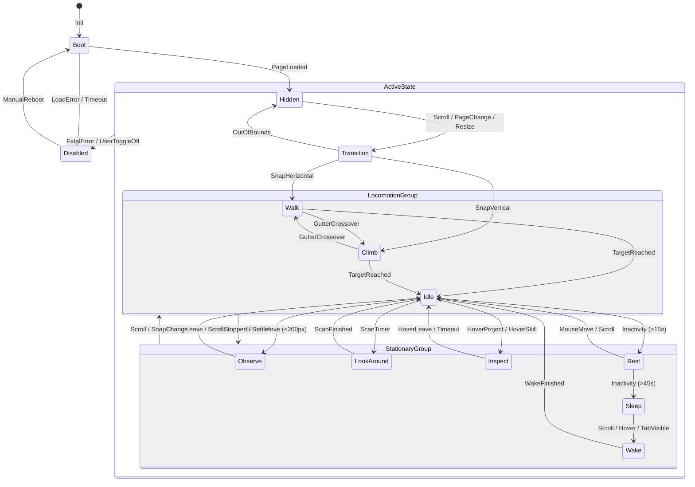

# Anton Behavior State Machine (v1.0)

This document is the authoritative behavior state machine specification and single source of truth for **Anton the Gecko**'s decision-making and motion engine. It outlines the state taxonomy, event listeners, transition rules, priority systems, and error handlers.

To ensure consistency, this state machine is **platform-agnostic**. It can be implemented in React Three Fiber (Three.js/Zustand), Rive, CSS/JS State Engines, or standard Game Engine Controllers (Unity/Unreal). **Anton is design-locked. Do not redesign him.**

---

## 1. Overview
The purpose of this state machine is to govern Anton's autonomy, making him feel like an intelligent, lifelike gecko companion. 

### Core State Engine Axioms:
1. **Behavior Origin**: Every physical movement, gaze change, or texture transition *must* originate from a defined state. Ad-hoc animations or positioning hacks bypass the state machine and are strictly forbidden.
2. **Resource Optimization**: CPU and GPU requestAnimationFrame loops are directly tied to state complexity. Lower-activity states (e.g. `Sleep`) throttle computation, while `Disabled` zeros all background overhead.
3. **Deterministic Transitions**: Anton's reactivity is predictable and testable. The state machine eliminates race conditions from concurrent scrolling, hovering, and click events.

---

## 2. Core States

### State: Boot
- **Purpose**: Initializes the animation engine, registers event listeners, and tests WebGL capabilities and asset availability.
- **Entry Conditions**: Application script mounts.
- **Exit Conditions**: Rig bindings completed, DOM bounds mapped.
- **Allowed Transitions**: `Hidden`, `Disabled`.
- **Loop Animation**: None (Static bind pose or initialization loader hidden).
- **Interruptible**: No.
- **Priority**: Level 1 (Critical).
- **Timeout**: $5000\text{ms}$ (Triggers fallback transition to `Disabled` if assets fail to load).

### State: Idle
- **Purpose**: baseline breathing and eye-blink state when Anton is resting on a card border without tracking any specific targets.
- **Entry Conditions**: Spatial transitions completed, no cursor in $200\text{px}$ tracking zone, page visible.
- **Exit Conditions**: Cursor moves within tracking zone, page scroll begins, page visibility hidden, click events.
- **Allowed Transitions**: `Observe`, `Look Around`, `Walk`, `Climb`, `Rest`, `Sleep`, `Hidden`, `Transition`, `Disabled`.
- **Loop Animation**: `idle_breathing`.
- **Interruptible**: Yes.
- **Priority**: Level 6 (Default).
- **Timeout**: $15000\text{ms}$ (Automatically transitions to `Rest` to conserve physical presence posture).

### State: Observe
- **Purpose**: Interactive cursor tracking mode. Anton follows the mouse cursor with head and eye gaze vectors.
- **Entry Conditions**: Mouse cursor enters the $200\text{px}$ boundary surrounding Anton's head center.
- **Exit Conditions**: Cursor leaves the $200\text{px}$ boundary, cursor remains static for $>3.0\text{s}$ (triggers walk closer or return to Idle), scrolling starts.
- **Allowed Transitions**: `Idle`, `Look Around`, `Walk`, `Climb`, `Rest`, `Inspect`, `Hidden`, `Transition`, `Disabled`.
- **Loop Animation**: `observe_cursor` (Procedural dynamic tracking).
- **Interruptible**: Yes.
- **Priority**: Level 5 (Low).
- **Timeout**: None.

### State: Look Around
- **Purpose**: Periodic scanning of the viewport or card borders. Displays visual exploration.
- **Entry Conditions**: Idle timer tick, or scroll snapping settles in a new portfolio category.
- **Exit Conditions**: Gaze target spotted, timer expires, scroll started.
- **Allowed Transitions**: `Idle`, `Observe`, `Walk`, `Climb`, `Rest`, `Hidden`, `Transition`, `Disabled`.
- **Loop Animation**: `walk_look_around` (if combined with walk) or random scan lookups.
- **Interruptible**: Yes.
- **Priority**: Level 5 (Low).
- **Timeout**: $3000\text{ms}$ (Returns to `Idle`).

### State: Walk
- **Purpose**: Horizontal crawling along CSS card borders.
- **Trigger/Entry**: Scroll snap alignment coordinate change on same horizontal plane.
- **Exit Conditions**: Target coordinate achieved, vertical boundary collision.
- **Allowed Transitions**: `Idle`, `Observe`, `Climb`, `Rest`, `Hidden`, `Transition`, `Disabled`.
- **Loop Animation**: `traverse_walk`.
- **Interruptible**: Yes.
- **Priority**: Level 4 (Mid).
- **Timeout**: $5000\text{ms}$ (Force aligns to closest border if path blocked).

### State: Climb
- **Purpose**: Vertical crawling up or down card gutters and boundaries.
- **Entry Conditions**: Scroll movement pushes Anton vertically.
- **Exit Conditions**: Scroll movement halts, target vertical position achieved.
- **Allowed Transitions**: `Idle`, `Observe`, `Walk`, `Hidden`, `Transition`, `Disabled`.
- **Loop Animation**: `traverse_climb`.
- **Interruptible**: Yes.
- **Priority**: Level 4 (Mid).
- **Timeout**: $5000\text{ms}$ (Snaps to nearest horizontal line if climb gets stuck).

### State: Rest
- **Purpose**: Flat resting stance closer to card surfaces, signaling relaxation before entering deep sleep.
- **Entry Conditions**: Stationary in `Idle` for $>15\text{s}$.
- **Exit Conditions**: Cursor enters tracking zone, scroll events, clicks.
- **Allowed Transitions**: `Idle`, `Observe`, `Walk`, `Climb`, `Sleep`, `Hidden`, `Transition`, `Disabled`.
- **Loop Animation**: Stagnant low pose (`rest_on_card`).
- **Interruptible**: Yes.
- **Priority**: Level 6 (Default).
- **Timeout**: $45000\text{ms}$ (Transitions to `Sleep`).

### State: Inspect
- **Purpose**: Deep investigation of hovered elements (e.g. project tags or skill chips).
- **Entry Conditions**: Hover event on active tags while Anton is snapped close by.
- **Exit Conditions**: Hover target removed, scroll starts, timer expires.
- **Allowed Transitions**: `Idle`, `Observe`, `Walk`, `Climb`, `Rest`, `Hidden`, `Transition`, `Disabled`.
- **Loop Animation**: Focus posture (`inspect_project` - narrow eyelids, contracted pupils).
- **Interruptible**: Yes.
- **Priority**: Level 5 (Low).
- **Timeout**: $4000\text{ms}$ (Returns to `Idle`).

### State: Sleep
- **Purpose**: Deep visual slumber, dropping browser resource requirements to a minimum.
- **Entry Conditions**: Idle/Rest state times out ($60\text{s}$ inactivity threshold).
- **Exit Conditions**: User scroll, cursor hover, window resize, tab status visible.
- **Allowed Transitions**: `Wake`, `Hidden`, `Disabled`.
- **Loop Animation**: Curled sleep posture (`idle_sleep` - closed eyes, tail wrapped).
- **Interruptible**: Yes (Triggers `Wake`).
- **Priority**: Level 6 (Default).
- **Timeout**: None.

### State: Wake
- **Purpose**: Transition phase to recover alertness from sleep.
- **Entry Conditions**: External interaction while in `Sleep` state.
- **Exit Conditions**: Wake animation clip finishes playback.
- **Allowed Transitions**: `Idle`, `Observe`, `Disabled`.
- **Loop Animation**: `wake_up` (played once).
- **Interruptible**: No.
- **Priority**: Level 2 (High).
- **Timeout**: $500\text{ms}$.

### State: Hidden
- **Purpose**: Culls Anton from screen rendering, used during out-of-view scrolls or resize buffers.
- **Entry Conditions**: Current snapped container cards leave the viewport, or window resize starts.
- **Exit Conditions**: Resize event settles, scroll snap coordinates updated.
- **Allowed Transitions**: `Boot`, `Wake`, `Idle`, `Observe`, `Walk`, `Climb`, `Disabled`, `Transition`.
- **Loop Animation**: None (Mesh culled, renderer paused).
- **Interruptible**: No.
- **Priority**: Level 2 (High).
- **Timeout**: None.

### State: Transition
- **Purpose**: Gutter teleports and section-changing snapping sequences.
- **Entry Conditions**: Nav menu items clicked, or scroll jumps across non-adjacent containers.
- **Exit Conditions**: Snap coordinates in target container achieved.
- **Allowed Transitions**: `Idle`, `Observe`, `Walk`, `Climb`, `Hidden`, `Disabled`.
- **Loop Animation**: `disappear_behind_ui`.
- **Interruptible**: No.
- **Priority**: Level 2 (High).
- **Timeout**: $1500\text{ms}$ (Emergency snap recovery to default home coordinates if teleport gets stuck).

### State: Disabled
- **Purpose**: Fail-safe recovery state. Completely removes Anton from the page DOM and layout, silences all canvas listeners, and releases all GPU resources.
- **Entry Conditions**: Critical boot errors, missing asset maps, or manual user companion switch toggled off.
- **Exit Conditions**: Manual system reboot call, or full page reload.
- **Allowed Transitions**: `Boot`.
- **Loop Animation**: None (Canvas hidden).
- **Interruptible**: No.
- **Priority**: Level 1 (Critical).
- **Timeout**: None.

---

## 3. Transition Rules

The table below maps all valid transitions. Transitions not defined in this table are invalid and must be blocked by the state engine.

| Source State | Destination State | Trigger Event | Guard Condition / Check |
| :--- | :--- | :--- | :--- |
| `Boot` | `Hidden` | `PageLoaded` | Assets loaded successfully |
| `Boot` | `Disabled` | `LoadError` | Missing asset file / WebGL failure |
| `Hidden` | `Transition` | `ScrollStarted` / `PageChange` | Target container coordinates mapped |
| `Transition` | `Walk` | `SnapAchieved` | Destination is on same horizontal plane |
| `Transition` | `Climb` | `SnapAchieved` | Destination is on vertical timeline plane |
| `Transition` | `Hidden` | `OutOfBounds` | Target section out of viewport |
| `Walk` | `Climb` | `GutterCrossover` | Claws enter vertical timeline boundaries |
| `Climb` | `Walk` | `GutterCrossover` | Claws return to horizontal card borders |
| `Walk` | `Idle` | `Settle` | Destination coordinates reached |
| `Climb` | `Idle` | `Settle` | Destination coordinates reached |
| `Idle` | `Observe` | `MouseMove` | Cursor coordinates inside 200px |
| `Observe` | `Idle` | `MouseLeave` | Cursor coordinates outside 200px |
| `Idle` | `Look Around` | `ScanTimer` | Inactivity timer hits 6s interval |
| `Look Around` | `Idle` | `ScanFinished` | Gaze sweep duration completes |
| `Idle` | `Inspect` | `HoverProject` / `HoverSkill` | Hover coordinates close to Anton |
| `Inspect` | `Idle` | `LeaveProject` / `Timeout` | Cursor leaves element or 4s timeout |
| `Idle` | `Rest` | `Inactivity` | Stationary with zero input for 15s |
| `Rest` | `Idle` | `MouseMove` / `ScrollStarted` | Input detected before sleep timeout |
| `Rest` | `Sleep` | `SleepTimer` | Total site inactivity reaches 60s |
| `Sleep` | `Wake` | `UserActivity` | Mouse moved / scroll started / tab visible |
| `Wake` | `Idle` | `WakeFinished` | Wake animation clip completes |
| `ActiveState` | `Hidden` | `OutOfBounds` / `Resize` | Current section exits screen / resize begins |
| `ActiveState` | `Disabled` | `SystemError` | Uncaught render error / CPU choke |

---

## 4. Event System

External environment events are passed into the state engine. The matrix below defines which states are eligible to receive and process specific events.

| Event Name | Description | Eligible Receiving States |
| :--- | :--- | :--- |
| `PageLoaded` | Initialization finished | `Boot` |
| `ScrollStarted`| Page scroll movement begins | `Idle`, `Observe`, `Look Around`, `Rest`, `Sleep` |
| `ScrollStopped`| Page scroll movement halts | `Walk`, `Climb`, `Transition` |
| `HoverProject` | Cursor hovers project tag/card | `Idle`, `Observe`, `Rest` |
| `LeaveProject` | Cursor exits project tag/card | `Inspect` |
| `HoverSkill` | Cursor hovers skill chip | `Idle`, `Observe` |
| `MouseMove` | Cursor coordinates update | `Idle`, `Observe`, `Rest`, `Sleep` (Wake) |
| `MouseIdle` | Cursor movement stops | `Observe` |
| `Resize` | Viewport dimensions change | Any active state |
| `ThemeChanged` | Light/Dark theme switched | `Idle`, `Observe`, `Rest` |
| `TabHidden` | Tab placed in background | Any active state (forced `Sleep`) |
| `TabVisible` | Tab refocused | `Sleep` (forced `Wake`) |
| `PageChange` | Navigation menu link clicked | Any active state |

---

## 5. Priority System

When multiple triggers compete (e.g. scroll begins while hovering a project tag and blinking), the engine resolves conflicts using this priority chain:

1. **Disabled** (System Override - critical recovery/user choice)
2. **Hidden** (Viewport preservation - prevents floating layouts)
3. **Transition** (Relocation mapping)
4. **Wake** (Urgent alert recovery)
5. **Climb** (Timeline scroll snappers)
6. **Walk** (Card gutter snappers)
7. **Inspect** (Curious detail reading)
8. **Observe** (Cursor tracking)
9. **Idle** (Default baseline)
10. **Sleep** (Power saving)

### Rationale:
- **System Constraints (1-3)** must always override cosmetic behaviors. If Anton is culled or loading has failed, visual logic must immediately yield to prevent console errors or rendering artifacts.
- **Physical Locomotion (5-6)** overrides **Stationary Inspections (7-8)**. If the user scrolls the page, Anton's top priority is snapping to layout guidelines to prevent clipping off-screen.
- **Power Management (10)** resides at the absolute bottom. It only activates when all other inputs are null.

---

## 6. Interrupt Rules

To prevent jerky animations, the state machine classifies animation clips into interruptible and non-interruptible categories.

| Animation / State | Interruptible? | Transition Handling |
| :--- | :---: | :--- |
| `Blink` | **Yes** | Additive layers allow interruptions without affecting core bones. |
| `Sleep` (Breathing) | **Yes** | Blends smoothly ($200\text{ms}$ crossfade) into the `Wake` clip. |
| `Sleep Curl` | **No** | Must complete full curl cycle to prevent tail snapping. |
| `Climb Stop` (Slide) | **No** | Overshoot and recovery slide must complete to preserve physics weight. |
| `Jump Down` | **No** | Launch, airborne splay, and landing impact compression cannot be interrupted. |
| `Celebrate` (Backflip) | **No** | Full backflip and landing must play out ($1.0\text{s}$). |
| `Inspect` | **Yes** | Immediate blend into Walk/Climb if scroll starts. |

---

## 7. Cooldown Rules

Cooldowns prevent repetitive loops and stuttering behaviors. The engine runs timers for the following triggers:

- **Blink**: Cooldown of $4000\text{ms}$ after a blink completes. Prevents successive rapid blinks.
- **Walk**: Cooldown of $800\text{ms}$ between step cycles during pauses. Preserves the gecko "dash-and-freeze" timing.
- **Inspect**: Cooldown of $3000\text{ms}$ on the same card/tag. Prevents endless inspection loop triggers on slight mouse drifts.
- **Tail Flick**: Cooldown of $5000\text{ms}$. Prevents spamming clicks from turning Anton into a spinning tail toy.
- **Sleep**: Cooldown of $15000\text{ms}$ after waking. Anton cannot fall back asleep immediately after waking.
- **Peek**: Cooldown of $10000\text{ms}$. Prevents repetitive peek transitions during window resizes.

---

## 8. Error Recovery

To ensure robust operation in production, the state machine handles exceptions using these fallback paths:

1. **Animation Loop Fails to Load**: If an action clip is missing or corrupted, the engine catches the loading exception, falls back to the static `idle_neutral` bind pose, and reports the error to log history without breaking page execution.
2. **Asset File Missing (.glb)**: If the 3D asset fails to load within the $5000\text{ms}$ Boot timeout, the state transitions directly to `Disabled`, hides the companion wrapper canvas, and allows the portfolio website to run normally.
3. **Tracking Target Disappears**: If a hovered project card or timeline milestone target is dynamically removed (e.g. filter category change), Anton immediately cancels the `Inspect` state, clears gaze coordinates, and transitions back to `Idle`.
4. **Invalid Transition Requested**: If an event requests an illegal state change (e.g. `Sleep` $\to$ `Climb` directly), the state machine rejects the event, logs a warning, and remains in the current safe state.

---

## 9. Future States (Placeholders)

The state machine reserves empty state registers for future milestones without requiring code architecture redesigns:

- **State: Butterfly_Chase** (Placeholder for butterfly stalking behaviors).
- **State: Coffee_Mug_Mount** (Snaps near a coffee cup on internship milestones).
- **State: Notebook_Inspect** (Inspects a research notebook element).
- **State: AI_Assistant_Interact** (Reacts to AI schema/chat dialogue overlays).
- **State: Celebration_Run** (Special victory runs on project click milestones).
- **State: Rain_Shelter** (Crawling under card headers during live weather rain feeds).
- **State: Mini_Game_Mode** (Allows small user interactions, locked by default).

---

## 10. Mermaid State Diagram

Below is the state chart mapping all transitions and priority layers:

