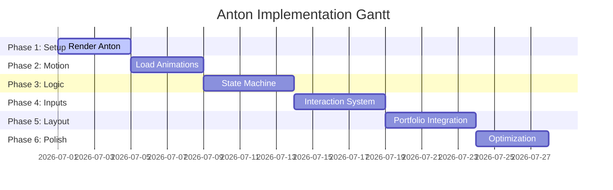

# Anton Technical Architecture (v1.0)

This document is the authoritative technical architecture specification and implementation blueprint for **Anton the Gecko**'s integration into the React-based portfolio. It establishes structural patterns, compares technology stacks, and outlines performance budgets, folder hierarchies, development phases, and future scalability paths.

**Anton is fully design-locked. Do not redesign him.**

---

## 1. Technology Options Comparison

### Option A: SVG + Framer Motion
This option uses raw inline HTML SVG vector structures animated dynamically via the `framer-motion` package in React.

- **Advantages**:
  - **Lightweight**: Zero external runtime asset loads beyond inline DOM. Extremely small initial bundle impact.
  - **CSS Styling**: Direct access to CSS tokens (`var(--accent-primary)`) and responsive styling.
  - **Zero WebGL Choke**: Runs natively on the browser's 2D compositor.
- **Disadvantages**:
  - **No Skeletal Deformations**: Animating organic joints (e.g. gecko knee bends, tail sways) requires heavy path interpolation calculations in CPU memory.
  - **No Inverse Kinematics (IK)**: Claws cannot dynamically adjust rotation or height when traversing rounded boundaries.
  - **No Volumetric Volume**: Lacks realistic shadows, specular highlights, and 3D surface depth.
- **Performance**: High DOM overhead if the SVG consists of many paths. Path morphing can cause CPU stutter on low-end mobile.
- **Maintainability**: Low. Storing complex limb coordinate states inside React hooks results in verbose, fragile boilerplate.
- **Animation Quality**: Poor. Motion feels mechanical, flat, and 2D. Cannot execute 3D maneuvers like backflips.
- **Future Scalability**: Poor. Adding accessories (e.g. laptops, glasses) requires redrawing and rewriting vector coordinates.
- **Difficulty**: Easy for flat slides, extremely high for realistic creeping lizard gaits.
- **Best Use Cases**: Simple 2D flat icons or minor floating page decorations.

---

### Option B: Rive
Rive is a vector-based real-time design and animation tool that outputs light, interactive web runtimes rendered directly onto a 2D Canvas.

- **Advantages**:
  - **Visual State Machines**: Transitions, blend trees, and inputs are configured visually in the Rive editor, decoupling logic from React.
  - **Lightweight Runtime**: The web assembly runtime is small ($\approx 150\text{KB}$ WASM load).
  - **High Animation Quality**: Full bone rigging, mesh deformations, and keyframes compile into tiny vector files.
  - **Interactive Inputs**: Direct exposure of state machine variables to React (e.g., setting a `mousePosition` state).
- **Disadvantages**:
  - **Proprietary Pipeline**: Modifying animations or coordinates requires edit permissions in the closed Rive Web App.
  - **Baked Styling**: Harder to align dynamically with real-time website lighting or complex PBR materials.
  - **Modular Limitations**: Swapping textures or appending custom 3D models at runtime is limited.
- **Performance**: High. Rendered using Canvas2D or WebGL, keeping CPU overhead minimal.
- **Maintainability**: High. Animation changes are published within the Rive file, requiring no code changes.
- **Learning Curve**: Medium. Requires familiarity with Rive's rigging interface.
- **Best Use Cases**: Interactive, highly styled 2D character animations with complex vector skeletal behaviors.

---

### Option C: React Three Fiber (R3F) + GLB
This option uses standard WebGL rendering via Three.js wrapped in React components, loading a rigged 3D model (GLB format).

- **Advantages**:
  - **True 3D Volume**: Supports PBR materials, glossy eye reflections, and realistic ambient occlusion drop shadows.
  - **Standard Modeling Skeleton**: Natively parses standard skeletal actions, blend shapes, and armature bones.
  - **Procedural Bone Control**: Simplifies calculations for cursor tracking by directly targeting rotation matrices on `Head` and `Eye` bones.
  - **Physical Snapping (IK)**: Raycasting enables paws to adjust alignment dynamically on vertical timeline walls and container card borders.
  - **Modular Sockets**: Allows dynamic runtime attachments of outfits or interactive items via child node parenting.
- **Disadvantages**:
  - **Bundle Size**: Requires pulling in `@react-three/fiber` and `three` (can be mitigated via lazy loading and CDN code splitting).
  - **Initialization Overhead**: First-load compiling of shaders can lag on old mobile hardware if not optimized.
- **Performance**: Outstanding on GPU. CPU is only utilized for simple state logic, while bone calculations run on hardware.
- **Maintainability**: High. GLB assets are separate from React logic. Developers import model nodes directly using utility pipelines (e.g. `@react-three/drei`'s `useGLTF`).
- **Animation Quality**: Cinematic, premium, and fully organic.
- **Difficulty**: High. Requires knowledge of 3D asset loaders, vector math, and WebGL memory disposal.
- **Best Use Cases**: High-fidelity, premium interactive web companions requiring volumetric depth and physics interaction.

---

## 2. Recommended Approach & Justification
The recommended implementation approach is **Option C: React Three Fiber + GLB**.

### Justification:
1. **Skeletal Requirements**: Anton's [3D Production Plan](file:///c:/Users/arsal/Desktop/portfolio/anton/docs/3D_Production_Plan.md) details a 32-bone deform rig and multiple mesh shape keys (`Blink_L`/`Blink_R`, `Squint_L`/`Squint_R`, `Pupil_Contract`/`Pupil_Dilate`). Only a WebGL-based GLTF loader natively parses these configurations without manual interpolation.
2. **Geometric Snapping**: Anton must traverse vertical walls during scrolling and rotate $90^\circ$ relative to card gutters. R3F supports real-time Raycasting to calculate surface normal vectors, allowing Anton to pivot his orientation dynamically.
3. **Materials & Shading**: Anton's matte day-gecko skin texture ($0.85$ roughness) and mirror-finish eyes ($0.98$ glossiness) can only be represented using PBR (Physically Based Rendering) shaders. Rive and SVG options struggle to approximate volumetric specular bounce and drop-shadow occlusions.
4. **Item Socket Sockets**: Future features require attaching notebooks, laptops, and code cubes to Anton's paws. R3F allows child elements to be dynamically parented to specific rig bone node transforms (`Socket_Front_L`) at runtime, which is unsupported or overly complex in 2D vectors.

---

## 3. Performance Budget

To maintain a frame rate of **60 FPS** on both desktop and mobile devices, the implementation must adhere to this strict performance budget:

| Parameter | Limit | Critical Redline |
| :--- | :--- | :--- |
| **GLB File Size (Draco)** | **$< 800\text{ KB}$** | $> 1.5\text{ MB}$ |
| **Texture Atlas Dimensions**| **$1024 \times 1024$** (Single Map) | $2048 \times 2048$ / Multi-Map |
| **Mesh Triangle Count** | **$3,800$ triangles** | $> 5,500$ triangles |
| **Draw Calls** | **1** (Single PBR Material) | $> 2$ |
| **Rig Bone Count** | **32 bones** | $> 45$ bones |
| **Memory footprint** | **$< 15\text{ MB}$ WebGL memory** | $> 35\text{ MB}$ WebGL memory |

### Runtime Tuning Constraints:
- **Target Frame Rate**: 60 FPS on desktop, capped at 30 FPS on low-power mobile devices.
- **Animation Update Frequency**: The core state machine update tick runs at **$60\text{Hz}$** ($16.6\text{ms}$ intervals). Gaze target interpolation (`lerp`) runs inside the Three.js `useFrame` render loop.
- **Mobile Considerations**: 
  - Dynamic shadow maps are disabled on mobile devices (falls back to a static ambient occlusion circle mesh parented beneath Anton's root bone).
  - WebGL rendering is paused (`requestAnimationFrame` halted) whenever Anton enters the `Hidden` or `Sleep` state.

---

## 4. Project Structure

We recommend the following folder structure to keep Anton's assets, React hooks, state files, and visual components separated:

```
src/
└── components/
    └── anton/
        ├── assets/
        │   ├── anton_v1.0.0.glb          # Optimized Draco-compressed 3D GLB
        │   └── shadow_blob.png            # Fallback 2D ambient shadow texture
        ├── animations/
        │   ├── useClimbController.ts     # Handles vertical timeline climbing logic
        │   ├── useGazeController.ts      # Procedural lerping for cursor tracking
        │   └── useLocomotion.ts          # Handles crawl gaits and snapping coordinates
        ├── hooks/
        │   ├── useBoundaryObserver.ts    # Intersects Anton with card boundaries
        │   └── useScrollVelocity.ts      # Computes scroll speed for wind compression
        ├── state/
        │   ├── antonStore.ts             # Zustand slice for state machine properties
        │   └── stateMachine.ts           # Core logic transitions (Rules / Events)
        ├── AntonCanvas.tsx               # R3F Canvas wrapper with lighting setup
        ├── AntonModel.tsx                # GLB model loading and bone reference bindings
        └── index.tsx                     # Main export component (DOM wrapper container)
```

---

## 5. Development Phases



### Phase 1: Render Anton (Core 3D Engine Setup)
- Set up `AntonCanvas.tsx` with optimized lighting, ambient lights, and camera configuration.
- Integrate the Draco GLTF loader. Load `anton_v1.0.0.glb` and render him in bind pose.
- Establish responsive Canvas positioning snap coordinates.

### Phase 2: Load animations (Clip Blending)
- Bind the Three.js `AnimationMixer` inside `AntonModel.tsx` using Drei's `useAnimations`.
- Map all baked action clips (`idle_neutral`, `traverse_walk`, `traverse_climb`, `celebrate_backflip`, `idle_sleep`, `wake_up`).
- Establish runtime clip blending and crossfades ($200\text{ms}$).

### Phase 3: State machine (State Implementation)
- Code the `antonStore.ts` engine (Zustand state store).
- Implement the transition rules defined in the [Behavior State Machine](file:///c:/Users/arsal/Desktop/portfolio/anton/docs/Behavior_State_Machine.md).
- Hook up timeouts and default fallback states.

### Phase 4: Interaction system (Input Hooks)
- Implement `useGazeController.ts` for dynamic cursor tracking.
- Set up boundary sensors for cursor distance ($200\text{px}$ zone).
- Bind global event emitters for mouse movements, clicks, and page visibility API updates.

### Phase 5: Portfolio integration (DOM Snapping)
- Implement `useBoundaryObserver.ts` using the browser's `ResizeObserver` and `BoundingClientRect` APIs.
- Bind Anton's 3D position coordinates to target HTML container card IDs (`#navbar`, `#home`, `#work`, `#experience`, `#skills`, `#about`, `#footer`).
- Code timeline climbing and scroll snap algorithms.

### Phase 6: Optimization (Performance Audit)
- Implement active render loops throttling: pause rendering when Anton is in `Sleep` or `Hidden` states.
- Run chrome-devtools memory profiles to check for GPU memory leaks.
- Test mobile fallbacks (turn off dynamic shadow maps, clamp FPS to 30).

---

## 6. Technical Risks & Mitigations

### Risk 1: Bundle Bloat / TBT (Total Blocking Time)
- **Detail**: Three.js and react-three-fiber add roughly $150\text{KB} - 200\text{KB}$ (gzipped) to the initial JS bundle, which can hurt web performance scores.
- **Mitigation**: Lazy load the entire `AntonCanvas` component. Only load and compile WebGL dependencies *after* the initial DOM content paints (using `React.lazy` and `Suspense`).

### Risk 2: WebGL Context Loss
- **Detail**: Browsers restrict the maximum number of concurrent active WebGL contexts. If other components (e.g. interactive 3D portfolios) request contexts, Anton might crash.
- **Mitigation**: Render Anton on a single shared global Canvas overlay that spans the layout, rather than spawning distinct canvases inside individual sections.

### Risk 3: Layout Shifts (Cumulative Layout Shift)
- **Detail**: Anton snaps to CSS boundaries dynamically. Delayed loading of fonts or flexbox layout reflows can cause coordinate offsets, leaving Anton floating in whitespace.
- **Mitigation**: Bind coordinates to DOM elements using a `ResizeObserver` listener. Trigger coordinate recalculations ($200\text{ms}$ debounce) whenever the document dimensions recalculate.

---

## 7. Future Expansion Paths

### 1. Multiple Outfits / Seasonal Themes
- The GLB model file must reserve basic vertex groups for the head and chest.
- Accessory assets (e.g. tiny sunglasses for summer, Santa hat for winter) can be modeled as distinct GLTF files and dynamically instantiated inside `AntonModel.tsx`, parenting them to `Socket_Front_L` or `Head` bones.

### 2. Additional Creatures
- The canvas engine, state machine, and interaction hooks are written using abstract base classes.
- Adding a second creature (e.g. a bird or butterfly) only requires passing a new GLB asset and loading its specific clip mapping configuration into the existing canvas manager.

### 3. Mini Games
- Implement `useLocomotion` hooks to accept path coordinates manually.
- When `Mini_Game_Mode` state is triggered, user cursor clicks override snapping systems, turning the mouse click coordinates into target path navigation goals for Anton to scurry toward.

### 4. AI Interactions
- Integrate a socket connection hooks with a backend LLM.
- While the user speaks or types, state parameters adjust: Anton transitions to `Inspect` or `Observe` state, and the state controller sends bone-driven micro-expressions (e.g. squinting when processing, tail wags on message completion).

### 5. Accessibility (a11y)
- **Core Rule**: Anton must remain purely cosmetic and must never block content.
- **Motion Reduction**: If the visitor has `prefers-reduced-motion` enabled in browser settings, the state machine defaults directly to `Disabled`, hiding the canvas container entirely to preserve cognitive layout cleanliness.
- **Screen Reader Support**: Ensure the canvas container has `role="img"` and a descriptive `aria-label` (e.g. *"Interactive 3D gecko companion crawling on portfolio layout"*).
